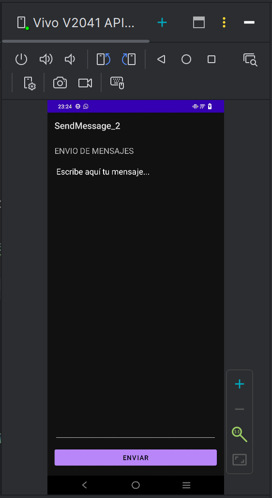

# Aplicación SendMessage

Aplicación Android sencilla desarrollada en Kotlin que permite redactar un mensaje en una primera pantalla y visualizarlo en una segunda pantalla junto a una imagen vectorial.

## Estructura del proyecto
- `SendMessageActivity`: Pantalla principal con un `EditText` para escribir el mensaje y un `Button` para enviar.
- `ViewMessageActivity`: Pantalla secundaria que recibe el mensaje mediante un `Intent` y lo muestra en un `TextView`.
- Archivos de diseño XML (`activity_send_message.xml` y `activity_view_message.xml`).

## Proceso de depuración
Se han utilizado registros con `Logcat` y puntos de interrupción (breakpoints) en el ciclo de vida de las actividades (`onCreate`) para verificar el paso de parámetros correcto entre actividades.

## Enlaces de interés
- [Documentación oficial de Android Developers](https://developer.android.com)
- [Guía de Intents en Android](https://developer.android.com/guide/components/intents-filters?hl=es-419)

